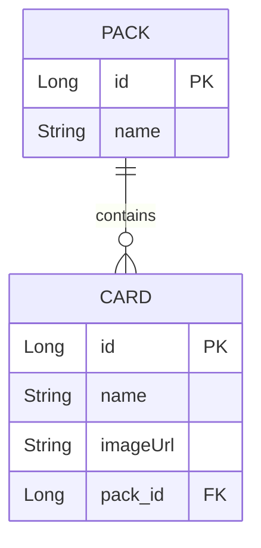
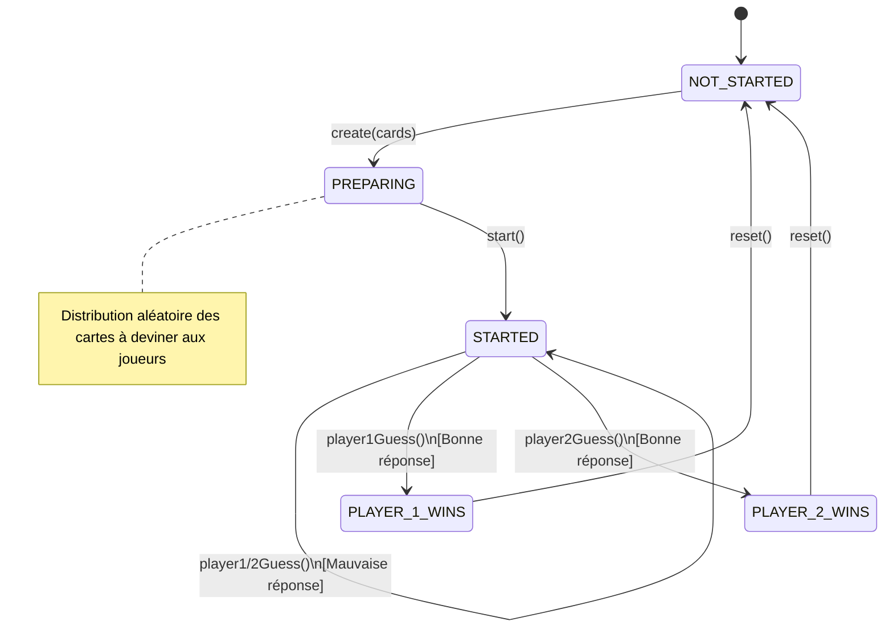

# 🕵️‍♂️ Qui-est-ce ? - API Backend

[](https://adoptium.net/)
[](https://quarkus.io/)
[]()

## 🎯 Objectifs du projet

Ce projet contient le code d'une application Java Backend permettant de jouer au jeu du **"Qui est-ce ?"** en utilisant des cartes personnalisées.

Conçu dans un but d'apprentissage et de montée en compétences, l'objectif principal est de fournir une implémentation fonctionnelle simple tout en explorant les capacités du framework **Quarkus**.

*Note : L'implémentation actuelle gère une seule instance de jeu à la fois de manière simplifiée (sans authentification ni sécurisation des API d'administration). Ces fonctionnalités sont prévues dans les prochaines itérations (voir la roadmap).*

--- 

## 🗄️ Modèle de données

La base de données permettant le stockage des informations relatives aux cartes et aux packs est une base de données relationnelle suivant le schéma suivant :



Les images sont quant à elles stockées dans un Bucket S3.

---

## 🎮 Logique de Jeu (Moteur d'état)

Le moteur de jeu (`GameEngine`) est géré comme un singleton (`@ApplicationScoped`) et fonctionne comme une machine à états. Il valide les actions des joueurs en fonction de l'état d'avancement de la partie.

Voici le cycle de vie complet d'une partie :



---

## 🚀 Installation et Lancement en local

### Prérequis
- **Java 21** installé sur l'environnement de développement.
- **Docker** en cours d'exécution. *Indispensable car Quarkus utilise les **Dev Services** (Testcontainers) pour monter automatiquement une base de données PostgreSQL et un bucket S3 au démarrage, sans aucune configuration manuelle requise !*

### Lancer l'application en mode développement
Pour démarrer le serveur avec le Live Coding (Hot Reload) activé, exécuter la commande suivante à la racine du projet :

```bash
./mvnw compile quarkus:dev
```
*(Sous Windows, utiliser `mvnw.cmd compile quarkus:dev`)*

Une fois démarrée, l'application est accessible sur `http://localhost:8080`.
L'interface de développement de Quarkus (Dev UI) est également disponible via `http://localhost:8080/q/dev`.

---

## 🛠️ Technologies & Apprentissages

### ☕ Java 21
- Utilisation des **Records** pour une modélisation concise et immuable des données.

### 🚀 Quarkus Framework
Quarkus est un framework Java "Cloud Native" (Subatomic & Supersonic Java) pensé pour les architectures modernes et les conteneurs. Ce projet m'a permis d'en explorer les fonctionnalités clés :

- **Optimisation au Build (Compile-time Boot) :** Contrairement aux frameworks traditionnels (comme Spring), Quarkus déplace de nombreuses tâches de démarrage (comme le scan des annotations) à la phase de compilation. Résultat : un démarrage extrêmement rapide et une faible consommation mémoire, idéal pour le scaling.
- **Live Coding (Hot Reload) :** Le serveur redémarre instantanément à chaque modification du code, permettant de tester les nouvelles implémentations en temps réel sans perte de contexte.
- **Dev Services :** Création automatique et transparente d'une base de données PostgreSQL et d'un serveur S3 (via Testcontainers) au démarrage du mode dev, sans avoir besoin de fournir de configuration complexe ("Zéro config").
- **Hibernate ORM avec Panache :** Utilisation d'une surcouche facilitant grandement l'accès aux données (implémentation du pattern Active Record / Repository).
- **Sérialisation JSON :** Mapping automatique entre le format JSON et les DTO (implémentés via les Records Java).
- **Conteneurisation native :** Possibilité de construire une image Docker optimisée directement via les commandes Quarkus.
- **QuarkusTest & REST-assured :** Mise en place de tests d'intégration fluides et lisibles pour valider les endpoints de l'API.

#### 📦 Extensions Quarkus utilisées
* **Données :** `quarkus-hibernate-orm-panache`, `quarkus-jdbc-postgresql`
* **Cloud & Stockage :** `quarkus-amazon-s3`, `software.amazon.awssdk`
* **Web & API :** `quarkus-rest-jackson`, `quarkus-smallrye-openapi` (génération automatique du Swagger)
* **Tests :** `quarkus-junit5-mockito`, `rest-assured`
* **Utilitaires :** `lombok`


#### 🧩 Ajouter une extension
Quarkus permet d'ajouter très facilement de nouvelles dépendances sans modifier manuellement le `pom.xml`. Par exemple, pour ajouter la validation des données (`hibernate-validator`), il suffit de lancer :

```bash
./mvnw quarkus:add-extension -Dextensions="hibernate-validator"
```
*(Si la CLI Quarkus est installée, la commande raccourcie est `quarkus ext add hibernate-validator`)*


---

## ⚙️ Intégration Continue (CI/CD)

Mise en place d'un workflow **GitHub Actions** simple permettant de garantir la qualité et la documentation du code à chaque push :
- 🏗️ Build automatique de la solution.
- 🧪 Exécution des tests unitaires.
- 📄 Publication du **Swagger/OpenAPI** généré automatiquement sur une page *GitHub Pages* (https://fileboss.github.io/qui-est-ce_back_API/), garantissant une documentation d'API interactive et toujours à jour.

---

## 🗺️ Évolutions futures

- [ ] **Multi-sessions :** Passer le serveur en mode multi-games pour gérer plusieurs parties en simultané.
- [ ] **Persistance des parties :** Enregistrer l'état des parties pour les retrouver si le serveur redémarre alors qu'une partie n'est pas terminée.
- [ ] **Architecture distribuée :** Déplacer toute la logique métier du jeu dans un microservice dédié développé en **Rust**.
- [ ] **Sécurité :** Mise en place d'une authentification (via **Keycloak**) et sécurisation des API administrateur.
- [ ] **Rate Limiting :** Protection contre le spam et les abus sur les API publiques de jeu.