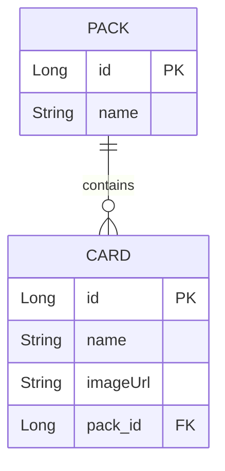
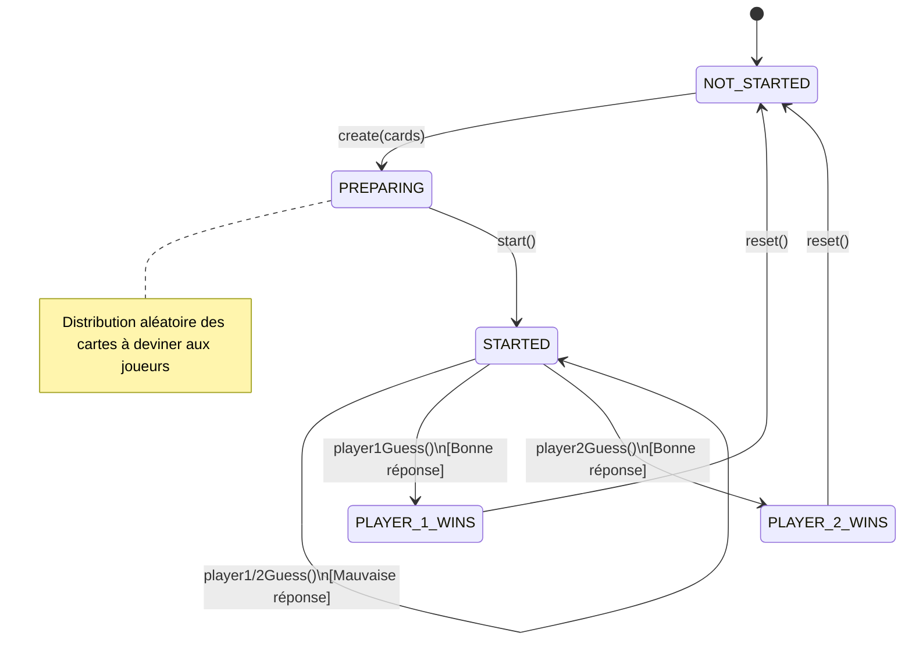

# 🕵️‍♂️ Qui-est-ce ? - API Backend

[](https://adoptium.net/)
[](https://quarkus.io/)
[]()

## 🎯 Objectifs du projet

Ce projet contient le code d'une application Java Backend permettant de jouer au jeu du **"Qui est-ce ?"** en utilisant des cartes personnalisées.

Conçu dans un but d'apprentissage et de montée en compétences, l'objectif principal est de fournir une implémentation fonctionnelle simple tout en explorant les capacités du framework **Quarkus**.

*Note : L'implémentation actuelle gère une seule instance de jeu à la fois.*

--- 

## 🗄️ Modèle de données

La base de données permettant le stockage des informations relatives aux cartes et aux packs est une base de données relationnelle suivant le schéma suivant :


```mermaid
erDiagram
    PACK {
        Long id PK
        String name
    }
    
    CARD {
        Long id PK
        String name
        String imageUrl
        Long pack_id FK
    }

    PACK ||--o{ CARD : "contains"
```

Les images sont quant à elles stockées dans un Bucket S3.

---

## 🎮 Logique de Jeu (Moteur d'état)

Le moteur de jeu (`GameEngine`) est géré comme un singleton (`@ApplicationScoped`) et fonctionne comme une machine à états. Il valide les actions des joueurs en fonction de l'état d'avancement de la partie.

Voici le cycle de vie complet d'une partie :


```mermaid
stateDiagram-v2
    [*] --> NOT_STARTED
    
    NOT_STARTED --> PREPARING : create(cards)
    note right of PREPARING
        Distribution aléatoire des 
        cartes à deviner aux joueurs
    end note
    
    PREPARING --> STARTED : start()
    
    STARTED --> STARTED : player1/2Guess()\n[Mauvaise réponse]
    
    STARTED --> PLAYER_1_WINS : player1Guess()\n[Bonne réponse]
    STARTED --> PLAYER_2_WINS : player2Guess()\n[Bonne réponse]
    
    PLAYER_1_WINS --> NOT_STARTED : reset()
    PLAYER_2_WINS --> NOT_STARTED : reset()
```

---

## 🚀 Installation et Lancement en local

### Prérequis
- **Java 21** installé sur l'environnement de développement.
- **Docker** en cours d'exécution. *Indispensable car Quarkus utilise les **Dev Services** (Testcontainers) pour monter automatiquement une base de données PostgreSQL et un bucket S3 au démarrage, sans aucune configuration manuelle requise !*

### Lancer l'application en mode développement
Pour démarrer le serveur avec le Live Coding (Hot Reload) activé, exécuter la commande suivante à la racine du projet :

```bash
./mvnw compile quarkus:dev
```
*(Sous Windows, utiliser `mvnw.cmd compile quarkus:dev`)*

Une fois démarrée, l'application est accessible sur `http://localhost:8080`.
L'interface de développement de Quarkus (Dev UI) est également disponible via `http://localhost:8080/q/dev`.

---

## 🛠️ Technologies & Apprentissages

### ☕ Java 21
- Utilisation des **Records** pour une modélisation concise et immuable des données.
- **Sérialisation JSON :** Mapping automatique entre le format JSON et les DTO (implémentés via les Records Java).


### 🚀 Quarkus Framework
Quarkus est un framework Java "Cloud Native" (Subatomic & Supersonic Java) pensé pour les architectures modernes et les conteneurs. Ce projet m'a permis d'en explorer les fonctionnalités clés :

- **Optimisation au Build (Compile-time Boot) :** Contrairement aux frameworks traditionnels (comme Spring), Quarkus déplace de nombreuses tâches de démarrage (comme le scan des annotations) à la phase de compilation. Résultat : un démarrage extrêmement rapide et une faible consommation mémoire, idéal pour le scaling.
- **Live Coding (Hot Reload) :** Le serveur redémarre instantanément à chaque modification du code, permettant de tester les nouvelles implémentations en temps réel sans perte de contexte.
- **Dev Services :** Création automatique et transparente d'une base de données PostgreSQL et d'un serveur S3 (via Testcontainers) au démarrage du mode dev, sans avoir besoin de fournir de configuration complexe ("Zéro config").
- **Hibernate ORM avec Panache :** Utilisation d'une surcouche facilitant grandement l'accès aux données (implémentation du pattern Active Record / Repository).
- **Conteneurisation native :** Possibilité de construire une image Docker optimisée directement via les commandes Quarkus.
- **QuarkusTest & REST-assured :** Mise en place de tests d'intégration fluides et lisibles pour valider les endpoints de l'API.

#### 📦 Extensions Quarkus utilisées
* **Données :** `quarkus-hibernate-orm-panache`, `quarkus-jdbc-postgresql`
* **Cloud & Stockage :** `quarkus-amazon-s3`, `software.amazon.awssdk`
* **Web & API :** `quarkus-rest-jackson`, `quarkus-smallrye-openapi` (génération automatique du Swagger)
* **Sécurité :** `quarkus-oidc` (Keycloak, Dev Services intégré)
* **WebSocket :** `quarkus-websockets-next`, `quarkus-reactive-routes` (filtre `@RouteFilter` pour l'auth WS)
* **Tests :** `quarkus-junit5-mockito`, `rest-assured`
* **Utilitaires :** `lombok`


#### 🧩 Ajouter une extension
Quarkus permet d'ajouter très facilement de nouvelles dépendances sans modifier manuellement le `pom.xml`. Par exemple, pour ajouter la validation des données (`hibernate-validator`), il suffit de lancer :

```bash
./mvnw quarkus:add-extension -Dextensions="hibernate-validator"
```
*(Si la CLI Quarkus est installée, la commande raccourcie est `quarkus ext add hibernate-validator`)*


---

## 🔐 Authentification (Keycloak)

L'API est sécurisée via **Keycloak** (OIDC), intégré grâce à l'extension `quarkus-oidc`. En mode développement, Quarkus provisionne automatiquement un conteneur Keycloak (Dev Services) et importe le realm `qui-est-ce` depuis `src/main/resources/realm-export.json`.

### Rôles

| Rôle | Droits |
|------|--------|
| `joueur` (`player`) | Lire toutes les ressources ; créer, rejoindre, démarrer, deviner, réinitialiser et supprimer des parties |
| `administrateur` (`admin`) | Tout ce que peut faire un joueur + gérer les packs et les cartes (CRUD) |

> Le rôle `admin` est un rôle composite qui inclut `player` : un administrateur peut donc également jouer.

### Obtenir un token (dev)

Le port Keycloak est affiché dans la Dev UI (`http://localhost:8080/q/dev`) → carte *OpenID Connect*.

```bash
curl -s -X POST http://localhost:<kc-port>/realms/qui-est-ce/protocol/openid-connect/token \
  -d "grant_type=password&client_id=qui-est-ce-back&client_secret=dev-secret&username=player1&password=password" \
  | jq -r .access_token
```

Utilisateurs de test (mot de passe `password`) : `player1`, `player2` (rôle : joueur), `admin` (rôle : administrateur).

### Utiliser le token

**REST :** ajouter le header `Authorization: Bearer <token>` à chaque requête.

**WebSocket :** passer le token en query param lors de la connexion :
```bash
wscat -c "ws://localhost:8080/ws/games?access_token=<token>"
```

#### Comment ça marche côté Quarkus

Les navigateurs n'autorisent pas l'envoi d'un header `Authorization` sur l'API JavaScript `WebSocket`, ce qui force à passer le JWT en query param. Or **Quarkus n'a pas de propriété de configuration native** pour lire un bearer token depuis la query string : sans intervention, le mécanisme OIDC ne voit aucun credential et renvoie **401** sur le handshake.

Deux options officielles existent :

1. **Sous-protocole WebSocket** (recommandé par Quarkus) : le client envoie `quarkus-http-upgrade#Authorization#Bearer <token>` comme sous-protocole. Côté serveur, activer `quarkus.websockets-next.server.propagate-subprotocol-headers=true`. Plus sûr (le token n'apparaît pas dans l'URL ni les logs) mais demande une adaptation du client.
2. **Filtre de route Vert.x** (utilisé ici) : un `@RouteFilter` promeut `?access_token=…` vers un header `Authorization: Bearer …` avant que le handler de sécurité ne s'exécute. Voir `util/WebSocketTokenFilter.java`. Nécessite l'extension `quarkus-reactive-routes`.

Le filtre retenu est minimal :

```java
@RouteFilter(500)               // priorité > handler de sécurité OIDC
void promoteAccessTokenQueryParamToHeader(RoutingContext rc) {
    if (rc.request().path().startsWith("/ws/")
            && rc.request().getHeader("Authorization") == null) {
        String token = rc.request().getParam("access_token");
        if (token != null && !token.isEmpty()) {
            rc.request().headers().add("Authorization", "Bearer " + token);
        }
    }
    rc.next();
}
```

Ainsi `@Authenticated` et les rôles continuent de fonctionner exactement comme pour les endpoints REST.

---

## 🌐 Déploiement VPS

### Hôte

VPS Fedora 43 (cloud minimal) — utilisateur `fedora` (sudoer), accès SSH par clé uniquement (`PasswordAuthentication no`, `PermitRootLogin no`). Pare-feu `firewalld` ouvrant 22/80/443. Mises à jour de sécurité automatiques via `dnf5-automatic.timer` (`apply_updates = yes`). Docker + Docker Compose installés. Snapshots hebdomadaires activés côté hébergeur.

### Domaines (production)

Domaine : `lepgu.fr` (OVH). La racine est réservée à un futur portfolio — toutes les URL applicatives sont nichées sous `qui-est-qui.lepgu.fr` :

| Service | URL |
|---------|-----|
| Frontend | `https://qui-est-qui.lepgu.fr` |
| Backend (REST + WebSocket) | `https://api.qui-est-qui.lepgu.fr` |
| Keycloak | `https://auth.qui-est-qui.lepgu.fr` |
| MinIO (URLs d'images) | `https://s3.qui-est-qui.lepgu.fr` |

Enregistrements DNS (A) : `qui-est-qui`, `api.qui-est-qui`, `auth.qui-est-qui`, `s3.qui-est-qui` → IP du VPS. TLS automatique via Let's Encrypt (Caddy, voir tâche 7 du roadmap).

> Ce schéma de nommage est verrouillé dans : Caddyfile, `OIDC_AUTH_SERVER_URL`, `redirectUris` / `webOrigins` du realm Keycloak, `quarkus.http.cors.origins`, et l'URL de base de l'API côté front. Tout changement doit être propagé partout.

---

## 🔐 Configuration Keycloak en production

Le fichier `src/main/resources/realm-export-prod.json` est un template du realm `qui-est-ce` prêt pour la production. Il ne contient **aucun utilisateur de test, aucun secret littéral et aucune URI wildcard**. Les secrets sont injectés au moment de l'import via les variables d'environnement du conteneur Keycloak (`${OIDC_CLIENT_SECRET}`, `${KEYCLOAK_ADMIN_SECRET}`).

### Modèle à deux clients (séparation des privilèges)

| Client | Rôle | Secret |
|--------|------|--------|
| `qui-est-ce-back` | Resource server OIDC — valide les tokens entrants. Aucun rôle admin. | `OIDC_CLIENT_SECRET` |
| `qui-est-ce-admin` | Client machine-to-machine — service-account avec `realm-management/manage-users` pour `POST /admin/users`. | `KEYCLOAK_ADMIN_SECRET` |
| `qui-est-ce-front` | Client public utilisé par le SPA (flow standard, audience mapper vers `qui-est-ce-back`). | — |

Cette séparation garantit qu'une fuite du secret côté front-channel (`qui-est-ce-back`) ne donne pas accès à la création d'utilisateurs.

### Import automatique au premier démarrage

Le fichier est importé via le flag `--import-realm` de Keycloak (v21+), câblé dans le Docker Compose (tâche 7). Comportement :

- **Premier démarrage** : Keycloak résout `${OIDC_CLIENT_SECRET}` et `${KEYCLOAK_ADMIN_SECRET}` depuis ses variables d'environnement et crée le realm avec ces valeurs.
- **Redémarrages suivants** : Keycloak détecte que le realm existe déjà et ignore l'import silencieusement (les secrets stockés en base ne bougent pas).

### Premier déploiement — étape par étape

1. **Générer deux secrets distincts** :
   ```bash
   openssl rand -hex 32   # → OIDC_CLIENT_SECRET
   openssl rand -hex 32   # → KEYCLOAK_ADMIN_SECRET
   ```

2. **Renseigner `.env`** (à partir de `.env.example`) :
   ```env
   OIDC_AUTH_SERVER_URL=https://auth.qui-est-qui.lepgu.fr/realms/qui-est-ce
   OIDC_CLIENT_SECRET=<valeur 1>
   KEYCLOAK_ADMIN_SECRET=<valeur 2>
   KEYCLOAK_URL=https://auth.qui-est-qui.lepgu.fr
   # … + variables DB / S3
   ```

3. **Câbler les deux secrets côté Keycloak** : dans le `docker-compose.yml` (tâche 7), exposer `OIDC_CLIENT_SECRET` et `KEYCLOAK_ADMIN_SECRET` au conteneur Keycloak via son bloc `environment:`. Sans cela, l'import littéralisera `${OIDC_CLIENT_SECRET}` comme valeur de secret — invalide.

4. **Démarrer la stack** :
   ```bash
   docker compose up -d
   ```
   Au premier boot, Keycloak importe le realm avec les deux secrets résolus. Le backend démarre ensuite : son `SecretGuard` (`src/main/java/admin/SecretGuard.java`) avorte le démarrage si l'une des variables est vide, vaut un placeholder (`change_me`, `dev-secret`, `REPLACE_WITH_PROD_SECRET`) ou est identique à l'autre.

5. **Vérifier que le realm répond** :
   ```bash
   curl https://auth.qui-est-qui.lepgu.fr/realms/qui-est-ce/.well-known/openid-configuration
   # → 200 avec "issuer" correspondant à OIDC_AUTH_SERVER_URL
   ```

6. **Créer le premier administrateur** : aucun utilisateur n'est inclus dans le template. Se connecter à la console admin Keycloak (master realm, identifiants bootstrap définis via `KEYCLOAK_ADMIN`/`KEYCLOAK_ADMIN_PASSWORD` au premier démarrage) et créer manuellement un utilisateur du realm `qui-est-ce` avec le rôle `admin` :

   > Realm `qui-est-ce` → Users → Add user → username → Save → Credentials (mot de passe non temporaire) → Role mapping → `admin`

   À partir de là, tout nouvel utilisateur passe par `POST /admin/users` (tâche 8 du roadmap).

### Rotation d'un secret

Pour faire tourner l'un des secrets après le premier déploiement :

1. Régénérer le secret dans la console admin Keycloak (`Clients → <client> → Credentials → Regenerate`).
2. Mettre à jour la variable correspondante dans `.env`.
3. Redémarrer le backend (`docker compose restart back`). Le `SecretGuard` valide la nouvelle valeur au boot.

---

## 🔌 Mises à jour en temps réel (WebSocket)

Deux endpoints WebSocket permettent aux clients de recevoir les changements d'état sans polling :

| Endpoint | Rôle |
|----------|------|
| `ws://localhost:8080/ws/game/{gameId}` | Suivi d'une partie : reçoit chaque transition d'état et résultat de devinette |
| `ws://localhost:8080/ws/games` | Lobby : reçoit les créations et suppressions de parties |

### Format du message

```json
{
  "gameId": "550e8400-e29b-41d4-a716-446655440000",
  "type": "STATE_CHANGE",
  "gameState": "STARTED",
  "correct": null
}
```

| Champ | Description |
|-------|-------------|
| `type` | `GAME_CREATED` · `STATE_CHANGE` · `DELETED` |
| `gameState` | Nouvel état (`PREPARING`, `STARTED`, `PLAYER_1_WINS`, …). Absent si `DELETED`. |
| `correct` | Présent uniquement après une devinette (`true` / `false`). |

### Exemple de connexion (wscat)

```bash
# Installer wscat
npm install -g wscat

# Se connecter au lobby (avec token)
wscat -c "ws://localhost:8080/ws/games?access_token=<token>"

# Se connecter à une partie spécifique (avec token)
wscat -c "ws://localhost:8080/ws/game/<gameId>?access_token=<token>"
```

---

## ⚙️ Intégration Continue (CI/CD)

Mise en place d'un workflow **GitHub Actions** simple permettant de garantir la qualité et la documentation du code à chaque push :
- 🏗️ Build automatique de la solution.
- 🧪 Exécution des tests unitaires.
- 📄 Publication du **Swagger/OpenAPI** généré automatiquement sur une page *GitHub Pages* (https://fileboss.github.io/qui-est-ce_back_API/), garantissant une documentation d'API interactive et toujours à jour.

---

## 🗺️ Évolutions futures

- [ ] **Multi-sessions :** Passer le serveur en mode multi-games pour gérer plusieurs parties en simultané.
- [ ] **Persistance des parties :** Enregistrer l'état des parties pour les retrouver si le serveur redémarre alors qu'une partie n'est pas terminée.
- [ ] **Architecture distribuée :** Déplacer toute la logique métier du jeu dans un microservice dédié développé en **Rust**.
- [x] **Sécurité :** Authentification via **Keycloak** et sécurisation des API.
- [ ] **Rate Limiting :** Protection contre le spam et les abus sur les API publiques de jeu.